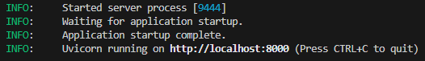

## Database API (FastAPI)
The Python API in `Database/api/database_api.py` exposes a minimal endpoint to record incorrect identifications in MySQL.

### Requirements
- Python 3.10+
- Install dependencies: `pip install -r requirements.txt`

### Configuration
Required environment variables (create a .env file for local development):
- DB_HOST=your_db_host (likely localhost)
- DB_NAME=your_db_name
- DB_PASSWORD=your_db_password
- DB_PORT=your_db_port (likely 8000)
- DB_USER=your_db_user
- SECRET_KEY=your_secret_key

### Run locally
1. Ensure HOST and PORT variables are set appropriately
2. Ensure the following code at the bottom of main.py is not commented out and run main.py:
```python
if __name__ == "__main__":
    uvicorn.run(
        "main:app",
        host=HOST,
        port=PORT,
        reload=False,
    )
```
The API should now be running and you should see the following in the terminal: 



### Endpoint: Report incorrect identification
- **Method/Path**: `POST /incorrect-identifications`
- **Purpose**: Record that a specific identification submission was wrong, linking the correct and incorrect species.
- **Request body** (`application/json`):
  ```
  {
    "identification_id": 1,
    "correct_species_id": 2,
    "incorrect_species_id": 3
  }
  ```
  - `identification_id`: Must already exist in `identification_submission`.
  - `correct_species_id` / `incorrect_species_id`: Must exist in `plant_species` and cannot be equal.
  - `incorrect_species_id` must also exist as an option in `identification_option` for that `identification_id` (composite FK).
- **Behavior**:
  - Validates referenced submission and species; ensures the incorrect species is one of the submission's options.
  - Inserts into `incorrect_identification` with `time_submitted = NOW()`; image URLs are available via joins if needed.
- **Responses** (examples):
  - `200 OK`:
    ```
    {
      "identification_id": 1,
      "correct_species_id": 2,
      "incorrect_species_id": 3,
      "message": "Incorrect identification recorded."
    }
    ```
  - `404 Not Found`: Missing submission or species rows.
  - `400 Bad Request`: Correct/incorrect species are the same, or required image URLs are missing.
  - `409 Conflict`: An incorrect identification already exists for this submission.
  - `500 Internal Server Error`: Database/connectivity issues.

### Endpoint: Get plant species img url
- **Method/Path**: `GET /plant-species-url`
- **Purpose**: Retrieve url associated with a certain plant species scientific name
- **Parameters**:
  - scientific_name: scientific name associated with the desired plant img_url
  - host: host associated with image server (same as api)
  - port: port associated with image server (same as api)
  - img_path: path to images. Currently '/plant-images'
  - engine: Engine
- **Behavior**:
  - Returns a working img_url that can be used to download or view the image
