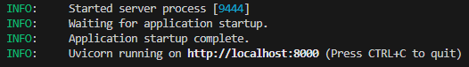

## Database API (FastAPI)
The Python API in `Database/api/database_api.py` exposes a minimal endpoint to record incorrect identifications in MySQL. As stated, this project uses FastAPI, which is licensed under the MIT license.

### Requirements
- Python 3.10+
- Install dependencies:
  ```bash 
  pip install -r requirements.txt
  ```
- Running MySQL instance with the schema from `Database/schema/initialize_database.sql`

### Configuration
Required environment variables (create a .env file for local development):
- DB_HOST=your_db_host (likely localhost)
- DB_NAME=your_db_name
- DB_PASSWORD=your_db_password
- DB_PORT=your_db_port (likely 3306)
- DB_USER=your_db_user
- SECRET_KEY=your_secret_key
- GOOGLE_SERVER_ID=google_server_id_from_app
- MAIL_USERNAME=email_address
- MAIL_PASSWORD=email_password
- MAIL_FROM=email_address
- MAIL_PORT=mail_server_port
- MAIL_SERVER=mail_server
- MAIL_FROM_NAME=name_to_send_mail_as
- MAIL_TLS=True
- MAIL_SSL=False
- USE_CREDENTIALS=True
- VALIDATE_CERTS=True

### Run locally
1. Ensure HOST and PORT variables are set appropriately
2. Ensure the following code at the bottom of main.py is not commented out and run main.py:
```python
if __name__ == "__main__":
    uvicorn.run(
        "main:app",
        host=HOST,
        port=PORT,
        reload=False,
    )
```
The API should now be running and you should see the following in the terminal: 



### Credits
This project uses [FastAPI](https://github.com/fastapi/fastapi), which is licensed under the MIT License.
